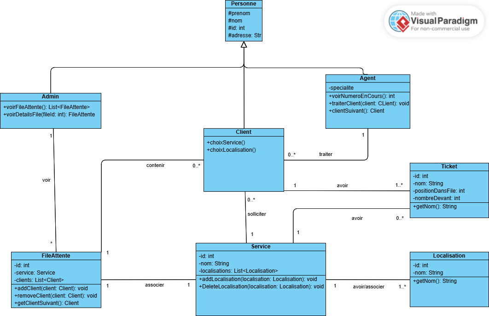

# Queue Management System

Design and implementation of a web application for queue management.

## Project Overview
This system allows users to select a service (e.g., utilities, banking), choose a location, and track their position in a service queue. The platform displays:
- E-ticket number
- User's position in the queue
- Number of people ahead
- Current ticket being served

Agents manage queues via an interface (e.g., move to next/previous client), and administrators access a backoffice dashboard to monitor all ongoing queues.

## System Architecture

### Actors
- **Client:** Beneficiary requesting services
- **Agent:** Service provider managing clients
- **Admin:** Administrator overseeing all queues
- ### Use Case Diagram

fig: use case diagram

### Functional Requirements
- Select service
- Choose location
- Agents call next/previous client
- View ongoing queues and current ticket numbers

### Main Classes
- Person
- Client
- Agent
- Admin
- Service
- Queue (FileAttente)
- Location

#### Key Relationships
- A Service can have multiple Locations.
- A Queue is linked to one Service but can contain multiple Clients.
- Agents serve clients in a queue.
- Admins have a global view over all queues.

fig: relationships between main classes

### Technology Stack
- **Frontend :** Next.js 15, Tailwind CSS
  - UI: [`queue-management-system-ui`](https://github.com/sdley/queue-management-system-ui)
- **Backend:** Spring Boot, MySQL, Spring Data JPA, Hibernate, RESTful API

## Getting Started
1. Clone this repository.
2. Install required dependencies: Java, Maven, MySQL.
3. Run the project using `mvn spring-boot:run`.
4. Access via `localhost:8080`.

## Contributing
- Read `CONTRIBUTING.md` for contribution guidelines.
- To participate in Hacktoberfest, look for issues tagged with `hacktoberfest` or `good first issue`.
- Please adhere to the `CODE_OF_CONDUCT.md`.

## License
MIT License, © [sdley Souleymane DIALLO](https://sdley.github.io/) 2025

## Acknowledgements
- Inspired by real-world queue management needs.
- Thanks to all contributors and the open-source community enthusuasts.

## Contact
For questions or support, reach out via [GitHub Issues]() or contact [sdley Souleymane DIALLO](https://sdley.github.io/).

