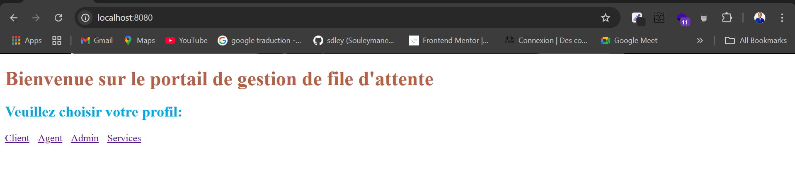
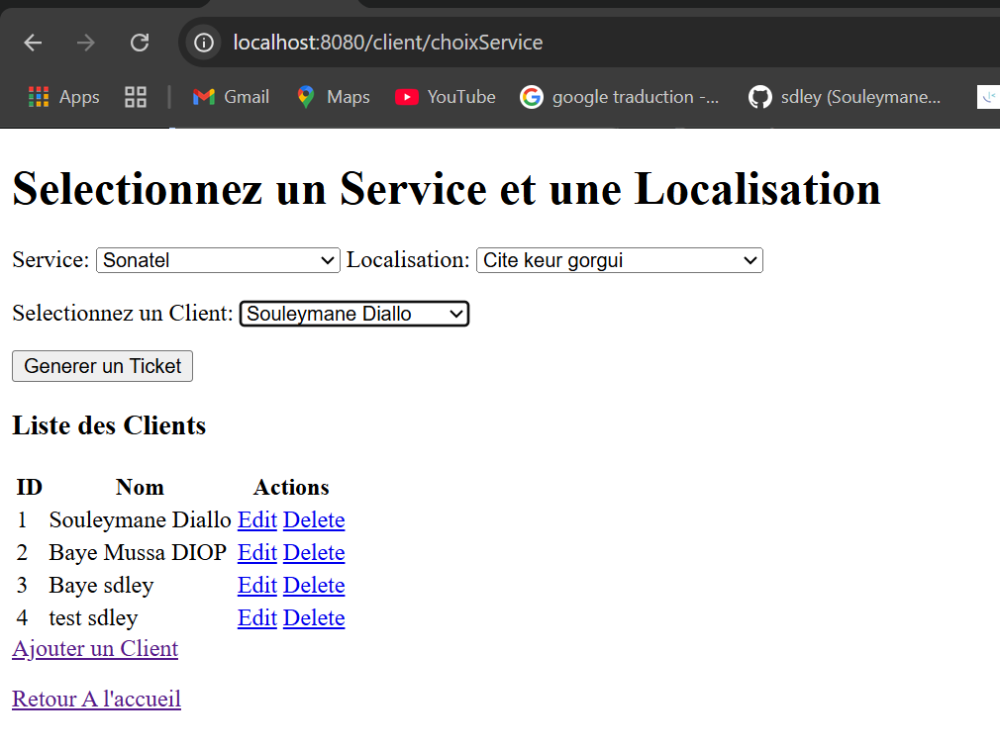
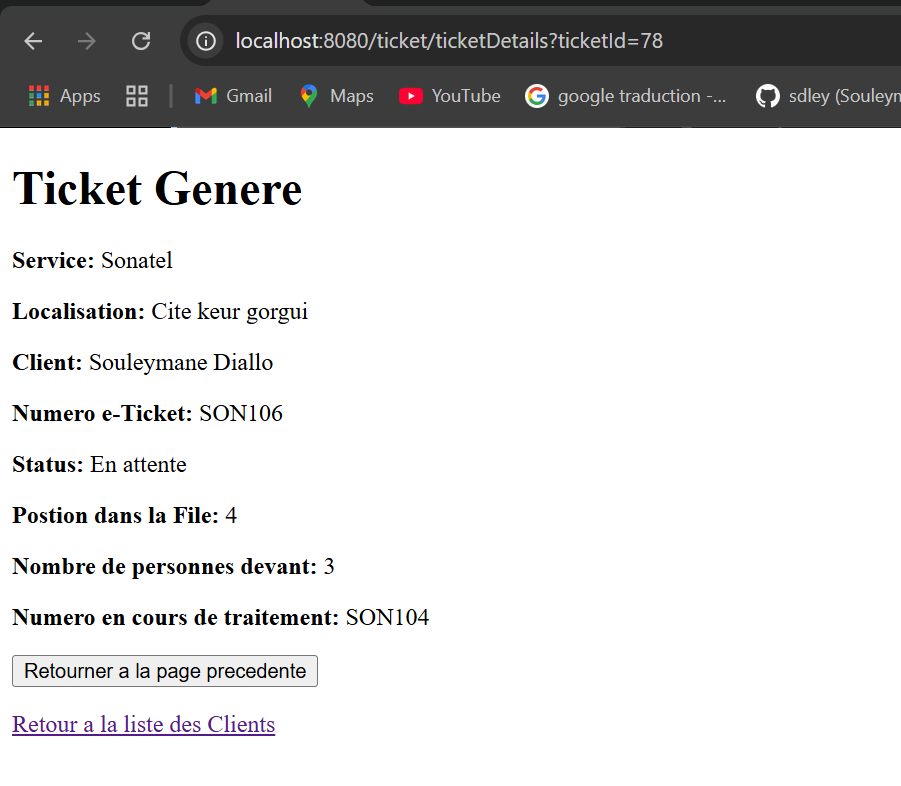
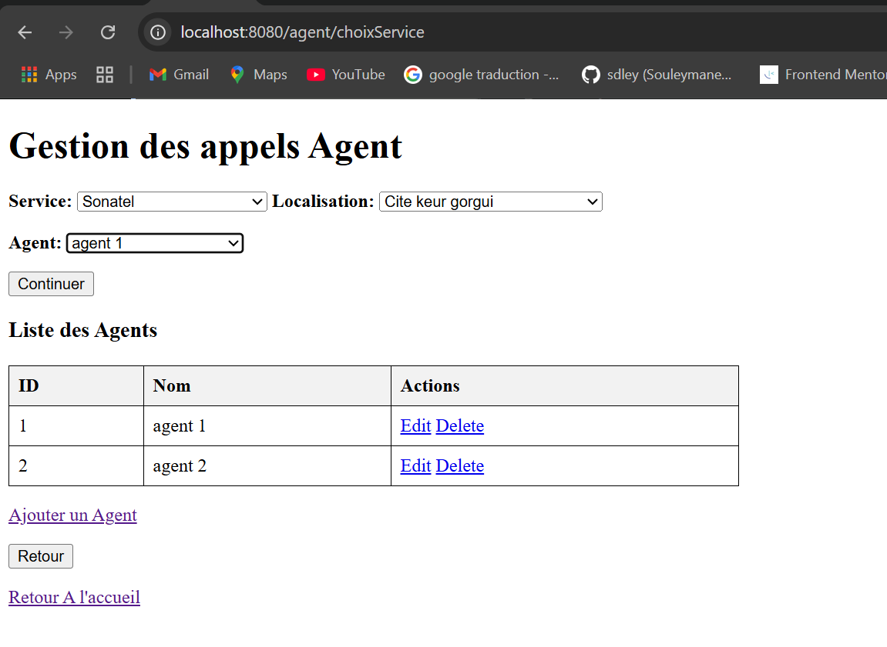
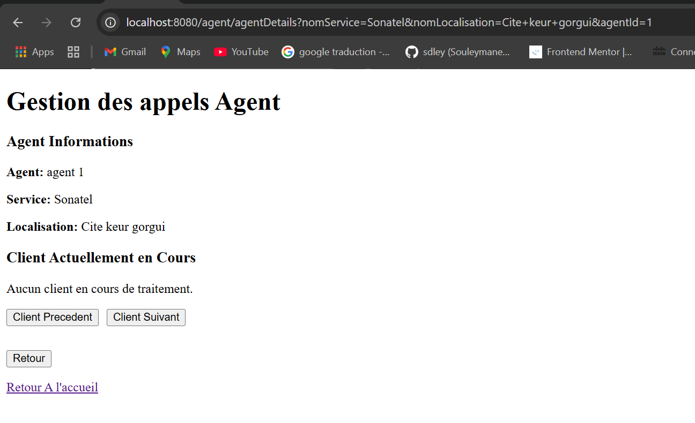
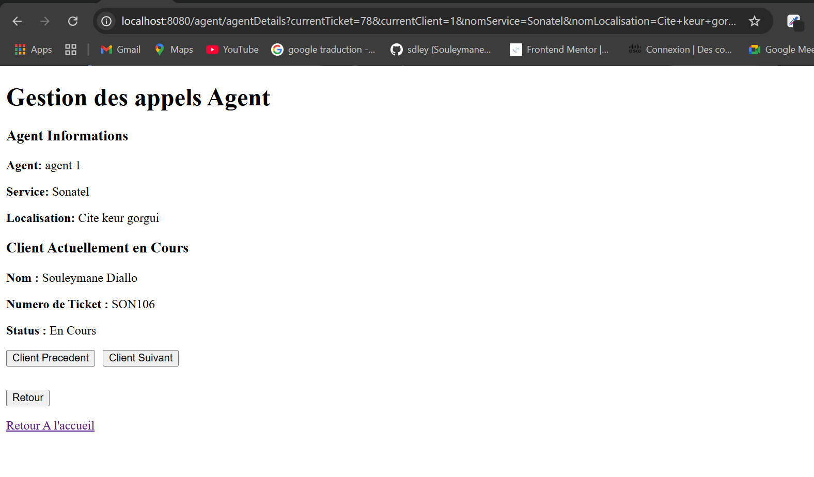
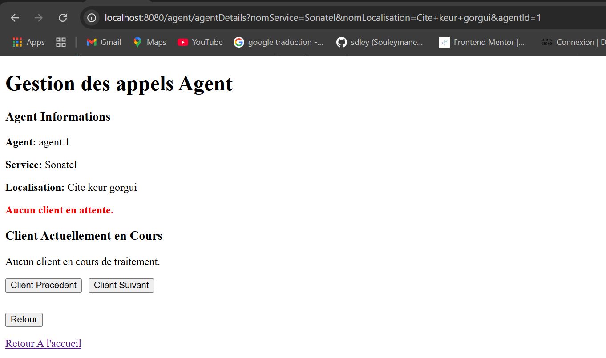
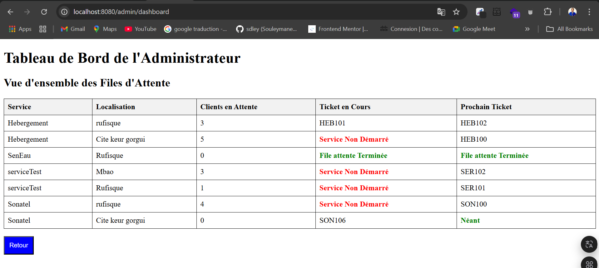
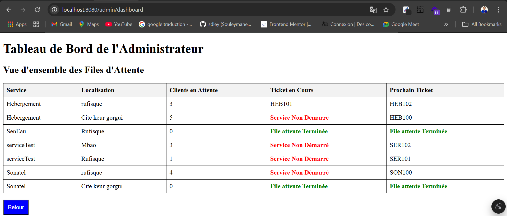

# Queue Managment System / Systeme de Gestion de file d'attente

## Presentation du cahier des charges
- Concevoir et réaliser une application de gestion de file d’attente.
- Lorsqu’on arrive sur le portail, on sélectionne le service(Seneau,
Orange, Senelec, Bank …)
- Une fois le service sélectionné, on choisit la localisation à partir
d’une liste alimentée depuis le backoffice de l’application.
- Le choix de la localisation du service redirige directement vers
une page montrant
  - Son numéro d’e-ticket (ex: votre numéro de ticket est 445)
  - Sa position dans la file (ex: vous êtes à la 19 ème position)
  - Le nombre de personnes devant
  - Le numéro qui est en train d’être traité
- A chaque appel d’un agent (qui dispose d’une interface où il peut
voir le numéro en cours, cliquer sur “client suivant” / “client
précédent” , le compteur du numéro en cours de traitement est
incrémenté.
- L’accès au backoffice par un admin doit permettre d’avoir une vue
globale sur l’ensemble des files en cours et le numéro de chaque
file

Passons a la conception du système 
## Conception
### Presentation des Acteurs du systeme
- client: beneficiaire de services
- agent: gestionnaire/prestataire des services
- admin: administrateur global/superviseur
### Evaluation des Besoins fonctionnels
- selection service
- choisir localisation
- appel precedent/suivant (*par un agent*)
- vue files d'attentes en cours (avec le numero de chaque file)

### Modelisation UML (Unified Modeling Language)
### Diagramme de cas d'utilisation

fig: diagramme de cas d'utilisation

### Diagramme de classe
Les principales classes du systeme sont: 
- Personne
- Client
- Agent
- Admin
- Service
- FileAttente
- Localisation.

Representons les interactions ou relations existantes entre ces differentes classes:
- Un Service peut avoir plusieurs Localisations.
- Une FileAttente est associée à un seul Service mais peut contenir plusieurs Clients.
- Un Agent peut traiter des clients dans une file d'attente.
- Un Admin peut voir toutes les files d'attente en cours.

fig: relations existantes entre les differentes classes

NB: *Ces diagrammes peuvent etre détaillés davantage en fonction des besoins.*

## Presentation de l'application
### Premiere version simplifiee
- Technologies:
  - Frontend: Java Server Pages (JSP), CSS
  - Backend: Spring Boot, MySQL, Spring Data JPA, Hibernate
- UI: 
  - Page d'accueil
  
  fig: page d'accueil
  - Client
  
  fig: choix service
  
  fig: generation de Ticket
  
  - Agent
  
  fig: Choix service et localisation
  
  fig: [connexion agent]
  
  fig: appel client *(cas 1)**
  
  fig: appel precedent/suivant [Aucun client en attente] *(cas 2)**

  - Page admin
  
  fig: dashboard admin - file du client SON106 *(cas 1)**
  
  fig: admin dashboard - file attente Terminee a la Sonatel Cite Keur Gorgui *(cas 2)**
  

## Copyright ©️
- [sdley Souleymane DIALLO](https://sdley.github.io/) 2025
- UAM, Polytech Diamniadio

  

